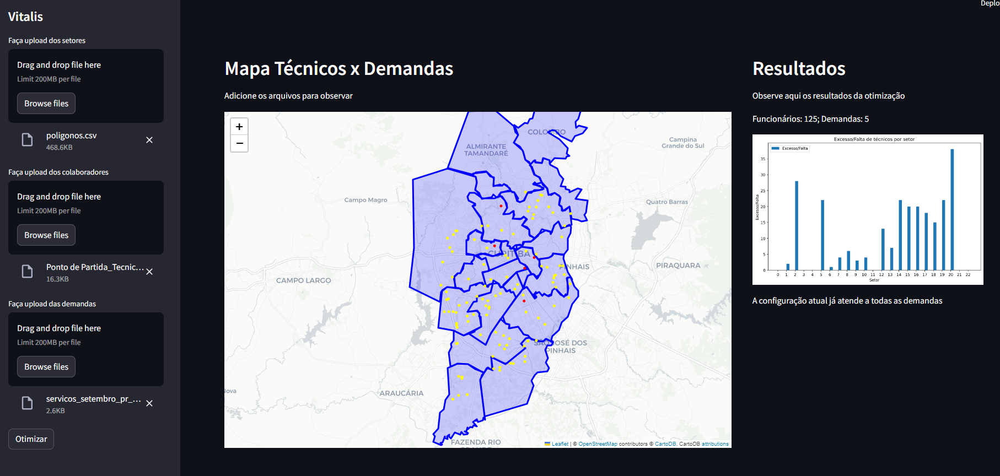
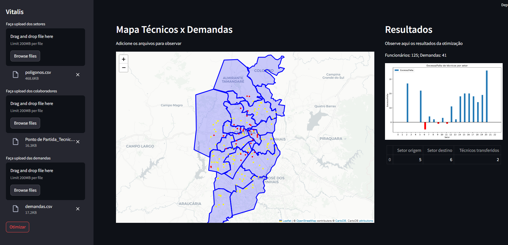
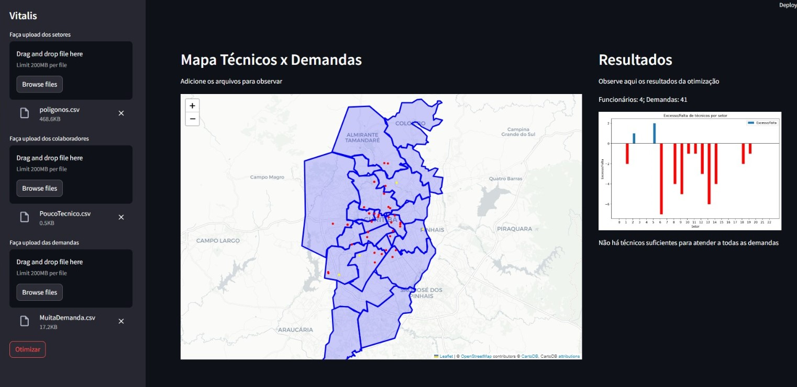
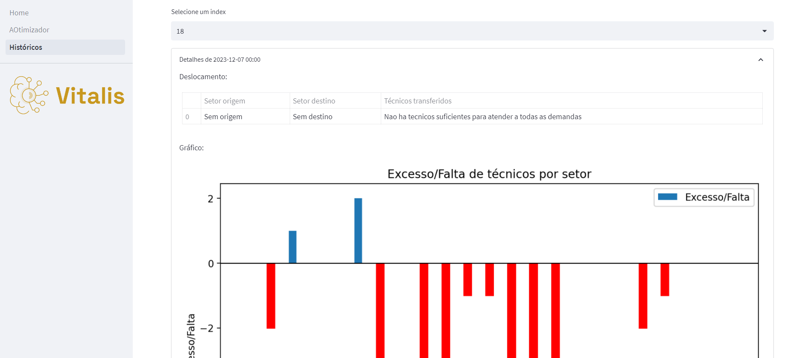
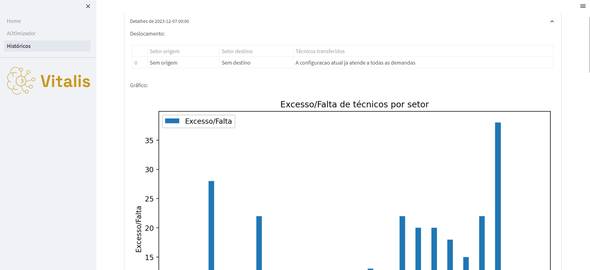
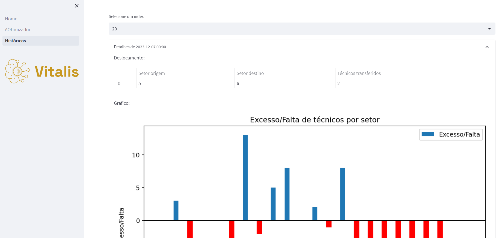
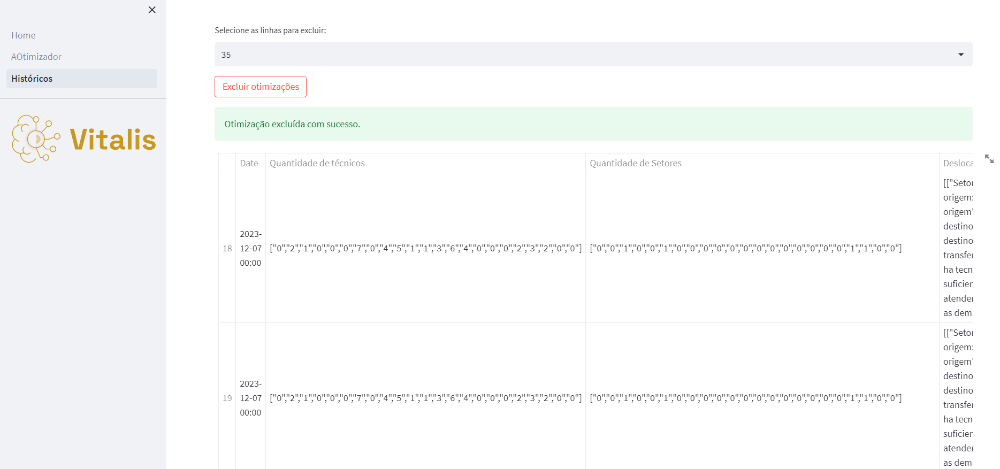

# Aplicação integrada da solução

## Documentação dos casos de testes 

O seguinte arquivo se refere à documentação de testes realizada na Sprint 4 para a versão integrada da solução. 

A solução do nosso grupo atualmente possui a integração do backend, frontend e planejador. É possível inserir CSVs dos polígonos dos setores (para observar no mapa), ponto de partida dos técnicos (para gerar a matriz de custos) e demandas de cada setor. Com esses três arquivos é possivel otimizar a configuração atual de técnicos, transferindo-os entre os setores. 

Para uma compreensão mais clara da integração da solução, optamos por dividir os testes em três cenários distintos:

* **A solução atual já é viável:** Este cenário testa a capacidade do sistema de reconhecer quando a configuração atual já é a melhor solução possível.
* **Solução otimizada:** Este cenário testa a capacidade do sistema de sugerir uma nova distribuição de técnicos quando a configuração atual não é eficiente.
* **Nenhuma solução viável:** Este cenário testa a capacidade do sistema de reconhecer e comunicar quando não há recursos suficientes para atender a todas as demandas.

## A solução atual já é viável
Neste caso de teste, configuramos os CSVs de tal forma que não seria necessário mover nenhum técnico de setor. Na configuração atual, todos os técnicos de cada setor conseguem atender todas as demandas do seu respectivo setor. Portanto, não há necessidade de mover nenhum técnico para outro setor.

Isso significa que a solução atual já é viável e eficiente. Cada técnico está no setor correto para atender todas as demandas, maximizando a eficiência e minimizando o tempo de deslocamento. Isso é ideal, pois garante que todos os setores estão sendo atendidos adequadamente com os recursos existentes.

Essa configuração de teste nos ajuda a verificar se o sistema é capaz de reconhecer quando a configuração atual já é a melhor solução possível. Isso é crucial para evitar movimentos desnecessários de técnicos e garantir que o sistema só sugira mudanças quando elas resultarem em uma melhoria na eficiência geral.

Em conclusão, os resultados deste caso de teste reforçam a eficácia da configuração atual, onde cada técnico permanece no seu respectivo setor, atendendo todas as demandas internas. A otimização alcançada demonstra que a alocação atual dos recursos é, de fato, a solução mais eficiente para maximizar a produtividade e minimizar o tempo de deslocamento. 

Figura 1 (Fonte: Elaboração própria)

## Solução Otimizada 
No caso de teste "Solução Otimizada", ajustamos os CSVs para criar uma situação em que os técnicos do setor 5 não eram suficientes para atender todas as demandas desse setor. Isso representava um desafio para a configuração atual e exigia uma nova solução para garantir que todas as demandas fossem atendidas de maneira eficiente.

Nesse cenário, cada técnico tem a capacidade de atender até duas demandas. No entanto, o setor 5 foi configurado com mais demandas do que seus técnicos poderiam atender. Isso criou um déficit de recursos no setor 5, exigindo uma redistribuição de técnicos para garantir que todas as demandas fossem atendidas.

A solução proposta envolveu a transferência de dois técnicos do setor 5 para o setor 6. Essa mudança permitiu que todas as demandas do setor 5 fossem atendidas, otimizando a distribuição de técnicos entre os setores.

Esse caso de teste foi crucial para verificar a eficácia do nosso algoritmo em propor novas soluções quando a configuração atual não é suficiente. O algoritmo foi capaz de identificar o déficit de recursos no setor 5 e sugerir uma redistribuição adequada de técnicos para resolver o problema.

Figura 2 (Fonte: Elaboração própria)

## Nenhuma solução viável
Neste último caso de teste, configuramos os CSVs de tal maneira que o algoritmo não encontrasse nenhuma solução viável. Nesse cenário, a quantidade de técnicos disponíveis era insuficiente para atender a demanda existente. Na configuração que criamos, tínhamos 4 técnicos disponíveis para atender a um total de 41 demandas. Considerando que um técnico consegue atender apenas duas demandas, mesmo se fossem transferidos técnicos de um setor para o outro, ainda assim não seria possível atender todas as demandas.

Este cenário representa uma situação em que a quantidade de recursos disponíveis (neste caso, técnicos) é insuficiente para atender a todas as demandas, independentemente de como esses recursos são distribuídos entre os setores. Isso cria uma situação em que nenhuma solução viável pode ser encontrada.

Nesse caso, o algoritmo deve idealmente retornar uma mensagem indicando que não há técnicos suficientes para atender todas as demandas. Isso valida que nosso sistema é capaz de reconhecer quando a quantidade de recursos é insuficiente e comunicar isso de maneira clara e eficaz.

Figura 3 (Fonte: Elaboração própria)

## Página de Históricos

Como mencionado acima, a nossa aplicação mapeia as 3 possibilidades. Ao clicar em otimizar, as informações geradas pelo otimizador são enviadas para o banco de dados e armazenadas na página de históricos também. Nela, é possível visualizar as otimizações já feitas por datas, junto com as informações vinda do banco de dados. 

### Leitura da Otimização 

É possível ver a resposta do otimizador para nenhuma solução viável encontrada.

É possível ver a resposta do otimizador para solução atual já é viável.

É possível ver a resposta do otimizador para a nova solução, com a quantidade de técnicos transferidos e os setores envolvidos nesse processo.

Todas as leituras são possíveis visualizar o gráfico de barras do excesso/falta de técnicos por cada setor também. 

### Deleção da Otimização e Atualização do histórico
Também é possível escolher a otimização que se queira excluir e fazer a deleção da mesma. O usuário recebe uma confirmação via frontend que a exclusão aconteceu no banco de dados. A tabela é atualizada sem a otimização excluída. 

