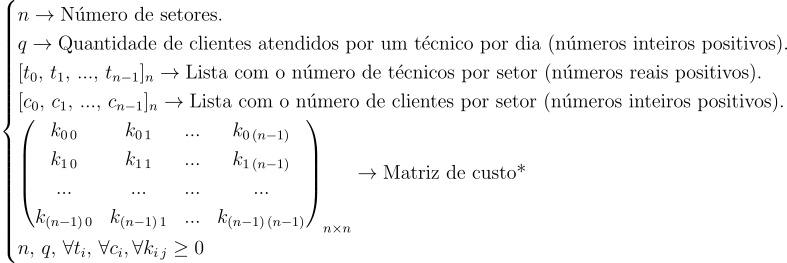
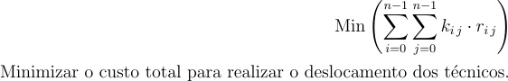
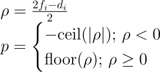

# Introdução

A otimização de recursos é uma área de extrema importância em diversos setores, desempenhando um papel crucial na eficiência operacional e na tomada de decisões estratégicas (Fernández Gil et al., 2023). Este campo concentra-se em encontrar a alocação mais eficaz e eficiente de recursos limitados para atender a determinados objetivos, levando em consideração uma série de restrições e variáveis complexas.

A relevância desse tema torna-se evidente em cenários empresariais, onde a alocação inadequada de recursos pode resultar em custos excessivos e na ineficiência da operação. Um exemplo claro desse desafio é observado em empresas de rede neutra, onde a alocação de técnicos para atendimento de clientes em diferentes áreas geográficas deve ser meticulosamente planejada.

Este trabalho propõe abordar esse problema específico, desenvolvendo um algoritmo de alta performance para otimizar a alocação de técnicos em áreas de operação. O objetivo é não apenas reduzir custos operacionais, mas também assegurar que todas as necessidades dos clientes sejam atendidas de forma eficaz e oportuna.

A pesquisa se destaca ao proporcionar uma contribuição tangível para a área da otimização de recursos, fornecendo uma solução prática e aplicável para empresas enfrentando desafios semelhantes (Joloudari et al., 2022). Ao explorar abordagens inovadoras e técnicas avançadas, este trabalho visa enriquecer o conhecimento e a prática nesse campo, oferecendo uma ferramenta valiosa para a gestão eficiente de recursos em empresas de diversos setores.

A importância deste estudo reside na sua aplicabilidade prática. A otimização de recursos é um desafio comum enfrentado por muitas empresas, e a falta de soluções eficazes pode levar a ineficiências operacionais e custos excessivos (Grigoriev et al., 2022). Ao desenvolver um algoritmo que pode ajudar a alocar recursos de maneira mais eficiente, este estudo tem o potencial de fazer uma contribuição significativa para a prática empresarial.

Finalmente, este estudo tem implicações significativas para a indústria de rede neutra. Ao desenvolver um algoritmo que pode ajudar a otimizar a alocação de técnicos, este trabalho pode ajudar as empresas a melhorar seus níveis de serviço e reduzir custos, levando a uma maior satisfação do cliente e a uma vantagem competitiva no mercado.

# Motivação

A motivação para este estudo surge de uma necessidade crescente de otimização de recursos em um mundo onde a eficiência operacional é crucial para a sustentabilidade e o sucesso das empresas. Em particular, no contexto do parceiro, a alocação eficiente de técnicos para atendimento de clientes em diferentes áreas geográficas representa um desafio significativo, impactando diretamente nos custos operacionais e na satisfação do cliente. A falta de soluções eficazes para esse problema pode resultar em alocações ineficientes, aumento de custos, e diminuição da qualidade dos serviços oferecidos.

A motivação é reforçada pela lacuna existente na literatura científica e na prática empresarial relacionada à otimização específica de recursos humanos em ambientes de alta variabilidade e demanda. A necessidade de um algoritmo que não apenas reduza custos, mas também maximize a eficiência operacional e a satisfação do cliente em ambientes dinâmicos e imprevisíveis é evidente.

Este estudo visa, portanto, contribuir para a área de otimização de recursos, oferecendo uma solução prática e aplicável que pode ser adaptada para diversos setores, além de proporcionar um melhor entendimento das complexidades envolvidas na alocação eficiente de recursos humanos.

# Metodologia

A metodologia empregada neste estudo envolve várias fases, abrangendo tanto o desenvolvimento teórico quanto a aplicação prática do algoritmo proposto.

Revisão da Literatura: Realizamos uma extensa revisão da literatura para compreender os desafios existentes e as soluções atuais em otimização de recursos. Esta revisão incluiu estudos acadêmicos, relatórios de indústria, e análises de casos reais.

Desenvolvimento do Algoritmo: Baseando-nos nos insights obtidos, desenvolvemos um algoritmo de alocação de recursos. Este algoritmo utiliza técnicas avançadas, como programação linear e heurísticas, para otimizar a alocação de técnicos em diferentes áreas geográficas.

Simulação e Testes: O algoritmo foi submetido a uma série de simulações e testes em cenários controlados. Utilizamos dados representativos e cenários simulados para avaliar a precisão, eficiência e adaptabilidade do algoritmo em diferentes situações, como escassez de recursos ou aumento súbito na demanda.

Análise dos Resultados: Os dados coletados dos testes foram analisados minuciosamente para avaliar o desempenho do algoritmo. Esta análise incluiu a avaliação da eficiência na alocação de recursos, a redução de custos operacionais e a capacidade de resposta a diferentes cenários.

Ajustes e Melhorias: Com base nos resultados dos testes, realizamos ajustes e melhorias no algoritmo para aprimorar sua eficácia e adaptabilidade.

Validação Prática: Por fim, o algoritmo foi testado em uma simulação de ambiente enfrentado pelo parceiro, para validar sua aplicabilidade e eficácia em cenários reais de operação.

Esta metodologia não só garante uma base sólida para o desenvolvimento do algoritmo, mas também assegura sua relevância e aplicabilidade prática.

# Trabalhos relacionados

Penha, R., Martens, C. D. P., & Kniess, C. T. (2019). 

O trabalho em questão aborda o desafio de alocar recursos humanos em atividades de projetos, um problema conhecido como Resource-Constrained Project Scheduling Problem. Este problema envolve a determinação da melhor alocação de um recurso humano entre várias atividades em um ambiente de múltiplos projetos, levando em consideração várias restrições. O trabalho propõe um modelo computacional para resolver este problema, que pode contribuir para a redução do tempo gasto pelos gestores no processo de elaboração do cronograma, bem como na contenção do custo e prazo dos projetos. Este estudo é particularmente relevante para o trabalho em curso que também enfrenta um desafio semelhante de alocação de recursos. O desafio é a distribuição eficiente de instalações a serem realizadas pelos seus técnicos. Portanto, uma abordagem semelhante à proposta neste estudo pode ser útil para o projeto na otimização da alocação de seus técnicos, com o objetivo de melhorar a eficiência de suas operações.

Colona, S. F., Kelch, R. dos S., & Gomes, A. das N. (2018). 

O trabalho discute a crise econômica e política brasileira, que levou a uma queda no consumo e na produção. Isso fez com que os operadores logísticos buscassem maneiras de reduzir custos e melhorar processos. O estudo de caso apresentado usou programação linear e a curva ABC para otimizar a distribuição e reduzir custos em um operador logístico em São Paulo. Relacionando com o problema enfrentado pelo nosso parceiro, a eficiência na distribuição de técnicos é crucial para atender aos níveis de serviço e reduzir custos. Ferramentas como a programação linear e a curva ABC podem ser úteis para otimizar a distribuição de técnicos e identificar clientes prioritários.

Jiang, S. (2019). 

O texto discute a gestão de recursos humanos como uma abordagem estratégica para a gestão eficaz de pessoas em uma organização, que é crucial para a gestão empresarial moderna. O artigo propõe otimizar os recursos humanos usando um sistema inteligente de gestão computacional. Ele fornece os princípios básicos da gestão de recursos humanos e propõe um sistema de índice para o desenvolvimento de projetos empresariais. O texto também explora o processo de hierarquia analítica e realiza um estudo de caso, concluindo que o método proposto de otimização de recursos humanos pode reduzir o período de construção e economizar recursos humanos significativamente.

Relacionando com nosso projeto, a eficiência na alocação de técnicos é crucial para atender aos níveis de serviço e reduzir custos. Assim como no estudo de caso, um sistema inteligente de gestão computacional pode ser útil para otimizar a alocação de técnicos. Além disso, a exploração do processo de hierarquia analítica pode ajudar nosso parceiro a identificar e priorizar os fatores mais importantes na gestão de recursos humanos.

de Moura, C., Antunes, F., de Oliveira, L. G., & Godarth, K. A. L. (2011). 

O texto discute a aplicação da programação linear. Nas empresas, essa técnica tem uma ampla gama de aplicações em atividades rotineiras e é usada na pesquisa operacional, trabalhando em conjunto com a informática. O método simplex, que pode ser implementado em processos automatizados, oferece uma margem de segurança para os gestores nas tomadas de decisão. A otimização simplex é um procedimento automatizável para planejamento experimental. Sua aplicação ocorre em atividades rotineiras e em sistemas estruturados como financeiro, controle de estoques, produção, recursos humanos, qualidade, entre outros. O texto sugere a aplicação da programação linear em problemas de alocação de pessoas.
Relacionando com o nosso projeto, a programação linear e o método simplex podem ser ferramentas úteis para otimizar a alocação de técnicos. Assim como no estudo de caso, a aplicação dessas técnicas pode oferecer uma margem de segurança para os gestores nas tomadas de decisão, contribuindo para a eficiência na distribuição de técnicos e a redução de custos operacionais. Além disso, essas técnicas podem ser aplicadas em várias áreas da empresa, incluindo recursos humanos e controle de estoques.

# Descrição dos algoritmos adotados para resolver o problema

Dois algoritmos utilizados pelo grupo foram uma abordagem gulosa para o problema (utilizada na solução final) e um algoritmo de força-bruta, para casos de teste.

## Algoritmo guloso

Para facilitar o entendimento de cada passo, um pseudo-código abaixo explica como esse algoritmo deve funcionar. Lembrando que, para o entendimento mais aprofundado, será necessário verificar a doumentação no próprio código: 

```yaml
-- tipos de dados -- 
(c) Setor:
    attrs:
        id
        demands
        workers
        distances
        score*
        
(c) SolutionType:
    consts:
        DONE
        UNFEASIBLE
        SUBOPTIMAL
        
(c) Transaction:
    attrs:
        sender_sector
        receiver_sector
        amount

-- variáveis advindas dos dados do cliente --
sectors # lista de objetos da classe Sector 

-- funcionamento do algoritmo -- 

(f) check-scores # retorna uma constante SolutionType (típo da solução do problema proposto pelo cliente)
if not SUBOPTIMAL return ERROR and HALT # retorna erro e para o programa caso o algoritmo não consiga otimizar o problema
(f) sort & split # divide a lista sectors em sender_sectors e receiver_sectors, ou seja, setores com scores positivos e negativos respectivamente
while receiver_sectors not empty: # esse loop acontece enquanto todos os setores não tiverem scores não negativos, ou seja, enquanto ainda existem demandas não atendidas
    (f) get_first_sector # seleciona o primeiro elemento da lista receiver_sectors 
    (f) sort_sender_sectors # faz a ordenação dos setores da lista sender_sectors de forma crescente de acordo com o seu custo de deslocamento para o setor receptor 
    (f) fill_sector # utiliza os funcionários em excesso da lista ordenada sender_sectors até que o score do setor receptor seja nulo e cria um objeto Transaction (transação)
    (f) remove_first_sector # remove o setor receptor da lista, uma vez que o mesmo já atendeu as suas demandas
    (f) add_cost # adiciona o custo dessa transação para o custo total da solução
    (f) add_to_solution # adiciona a transação a lista de transações dessa solução
return solution and HALT # retorna a solução em forma de uma lista de objetos Transaction (transação) e o custo total
```

## Algoritmo de Força-Bruta
No que tange o algoritmo de força-bruta, ele tenta deslocar técnicos de outro setor para atender um setor com técnicos em deficiência e verifica a partir de qual setor possui o menor deslocamento para todos os casos possíveis, até suprir a restrição de o setor possuir técnicos para atneder todas demandas. 

Este algoritmo só foi utilizado para fins de teste, comparando a otimalidade com o algoritmo guloso. Sua implementação final não entra na solução.

# Exemplo de fórmulas e expressões

Além da modelagem matemática, duas fórmulas muito utilizadas ao longo do artigo e desenvolvimento do algoritmo foram o cálculo de score e custo. 

## Modelagem matemática

### Variáveis do Problema



>  * O elemento $k_{i\,j}$ representa o custo de realocação do setor $i$ para o setor $j$.

### Variáveis de Decisão


> ** O elemento $r_{i\,j}$ representa o número de técnicos que devem ser deslocados do setor $i$ para o setor $j$ para atender às restrições e à função objetivo.

### Função Objetivo



### Restrições

Para todo $i$ de 0 a $n$ (ou seja, para toda região), as seguintes condições devem ser satisfeitas:


## Cálculo de Score
> - \* score ($p_i$): O score (escore) de um setor $i$ representa a quantidade de funcionários em excesso ou em falta nesse setor. Ele pode ser determinado pela fórmula matemática abaixo:



$$
\begin{array}{l}
f_i: \text{ Número de funcionários em $i$}\\
d_i: \text{ Número de demandas em $i$}
\end{array}
$$

Caso o score seja negativo e um número fracionário, arredondamos para cima (ceil) e número nos revela que o setor está necessitando de técnicos (provavelmente, com muito mais demandas do que técnicos). Caso o score seja positivo e fracionário, arrendondamos para baixo (floor) e esse número nos revela que o setor está com técnicos em excesso (quantidade de demandas é inferior a quantidade de técnicos para atender essas demandas).

## Cálculo de Custo

Este cálculo serve para avaliarmos o custo monetário de rodar uma operação, antes e depois da otimização.

Os valores de entrada para esse custo é a disposição dos técnicos entre os setores, o custo monetário (em reais) de um técnico atender o serviço e o custo monetário de um técnico parado (que não atende nenhuma demanda). 

O cálculo pode ser entendido pela imagem abaixo:


Nesta representação levamos em conta que o custo de atender a demanda e o custo de ficar parado é o mesmo.
A configuração dos técnicos entre os setores é a seguinte:
 * Setor 1: 4 técnicos / 8 demandas;
 * Setor 2: 3 técnicos/ 8 demandas = 1 técnico em falta;
 * Setor 3: 3 técnicos / 2 demandas = 1 técnico sobrando;
  
Podemos inferir que calculamos o custo antes e depois do algoritmo. Para realizar o cálculo do custo de cada setor, para os setores que não possuem técnicos parados somente multiplicamos pelo custo de atender a demanda o número de técnicos ativos. Agora para os setores com técnicos sobrando, multiplicamos pelo custo de atender a demanda o número de técnicos ativos mais o custo daquele técnico parado (que neste caso é o mesmo) vezes a quantidade de técnicos parados. 

No total, antes da otimização: R$380,00 para rodar essa operação. Depois: R$330,00. 

# Resultados obtidos

Nossa análise abrangeu uma série de testes destinados a avaliar a eficácia e a aplicabilidade do algoritmo desenvolvido. Realizamos testes sob algumas condições, buscando compreender a capacidade do algoritmo em lidar com diferentes cenários e sua contribuição para a resolução eficiente do problema.

## Dados representativos

Ao longo dos testes, utilizamos conjuntos de dados representativos e cenários simulados para examinar a precisão na alocação de recursos, o tempo de processamento, a escalabilidade e a adaptabilidade do algoritmo diante de variações nos parâmetros de entrada.


A legenda de cada teste é a seguinte: 
* Reta azul - runtime(s): tempo de execução do algoritmo;
* Reta laranja - negative score sum (un * 10^-3): representa a soma dos scores negativos de todos os setores (aqueles que precisam de funionários) para o determinado problema.
* Reta verde - number of sectors in need (un * 10^-3): número de setores que estão com score negativo (aqueles que precisam de funionários).

> OBSERVAÇÕES:
> - Para entender a legenda, é necessário entender nosso cálculo de score para cada setor, localizado na seção 'Exemplo de fórmulas e expressões';
> - A unidade de tempo é em segundos, mas mutiplicamos os casos da reta laranja e verde para afins de melhor visualização no gráfico;
> - A soma do score negativo (reta laranja) está em módulo. 

Resultados dos Testes:

Resultado 1)


O foco de teste teste era observar como o algoritmo lida ao aumentar o número de setores sendo que no geral apenas um único setor precisaria receber técnicos de outro setor. O score de todos setores são 0, apenas um setor é negativo e apenas um outro é positivo. 

No eixo x, aumentamos o número de setores com score zero (setores que não necessitam de técnicos). 

A ideia, no geral, era saber se o número de setores bruto aumenta o tempo de execução e no eixo y observamos o tempo de execução do algoritmo. 

Conclusão: o tempo de execução não é afetado conforme aumentamos a quantidade de setores com score zero.

> OBSERVAÇÃO:
> - A reta laranja e verde acabaram se localizando no eixo x e a visualização pode não ter ficado aparente. 

Resultado 2)

Aqui, aumentamos o score negativo e o score positivo de apenas um setor. Ou seja, as transferências vão ser maiores, aumentando o tempo de execução do algoritmo.

O foco neste teste era verificar se a quantidade de transferências necessárias entre os setores afetava o tempo de processamento do algoritmo.

Conclusão: aumentar o número de score negativo afeta o tempo de execução do algoritmo numa relação linear. 

Resultado 3)


Neste teste aumentamos, além do score negativo total dos setores, a quantidade de setores com score negativo. O mesmo foi feito para os setores de score positivo.

Além de maiores quantidades de transferências, a quantidade de transferências entre setores aumentou.

Conclusão: na teoria, pela complexidade do algoritmo, achávamos que o aumento de execução deveria ser quadrático, porém, de acordo com os testes e o resultado obtido a relação também é linear.

> OBSERVAÇÃO FINAL:
> - No eixo y, para o tempo de execução, desconsidere os saltos periódicos em todos os testes. Este é o tempo para se criar o dataframe com os dados representativos para o problema em questão (teste 1, 2 ou 3). No geral, são a criação dos setores com técnicos e demandas com dados em massa. Mas, para o algoritmo final, não haverá necessidade de criar esse dataframe, uma vez que será o dado de entrada pelo usuário.

## Dados reais

### Redução de deslocamento 

Além do conjunto de dados representativos, também analisamos os dados reais do nosso parceiro, V.Tal. Esta análise serviu para compararmos os resultados do nosso de otimização do nosso algoritmo em relação ao dia 2 de Setembro de 2023 dos dados reais da V.Tal na cidade de Curitiba, Paraná.

Nós filtramos os serviços deste dia, assim como o ponto de partida dos técnicos. Verificamos todas as vezes que os técnicos atenderam os serviços e consideramos o custo sendo a distância do ponto de partida do técnico até a demanda do cliente. Definimos essa movimentação justamente como deslocamento. Obtivemos um total de 29Km percorridos por todos os técnicos.

Agora, comparando com nosso algoritmo, após colocar os dados do mesmo dia como dado de entrada para o nosso algoritmo, realizamos o mesmo cálculo da distância percorrido por todos técnicos. Surpreendentemente, nosso algoritmo retornou uma configuração que economiza 5Km, totalizando 25Km percorridos pelos técnicos.

> CONCLUSÃO FINAL:
> - Pode-se concluir que o nosso algoritmo retorna uma configuração de técnicos entre os setores melhor do que a realizada no dia 2 de Setembro de 2023 pela V.TAL;
> - Partindo do pressuposto que o mesmo ocorre nos outros dias, também podemos concluir que o tempo operacional para realizar essa alocação reduz de maneira significativa com nosso algoritmo. 

### Força Bruta x Algoritmo Guloso
Um fato interessante é que podemos provar otimalidade para este caso do dia 2 de Setembro de 2023 pois comparamos os resultados do nosso algoritmo guloso com o algoritmo de força bruta (ver seção 'Descrição dos algoritmos adotados para resolver o problema'), que avalia todas as soluções possíveis e retorna a melhor. 

O algoritmo guloso retorna uma solução idêntica ao de força bruta. Sendo assim, podemos concluir que o algoritmo guloso, para este caso somente, retorna uma solução ótima.

### Redução de custo
Além da verificação se o nosso algoritmo reduziu o deslocamento geral dos técnicos entre os setores, também realizamos um cálculo de custo, para comparar o custo antes e depois da nossa otimização. 

Para entender como fazemos este cálculo, veja a seção # 'Exemplo de fórmulas e expressões'.

O caso citado naquela seção foi somente para ilustração do cálculo, mas e com dados reais da V.Tal e valores mais expressivos? 

Também realizamos um teste com um conjunto de dados da V.Tal, com 41 demandas e 125 técnicos espalhados por 21 setores de Curitiba, Paraná. Estabelecemos um valor monetário de R$60,00 para atender as demandas e um valor monetário de R$80,00 para ficar parado, por técnico. Com o resultado deste conjunto de dados: 
* Antes da otimização: R$2600,00
* Depois da otimização: R$1920,00
  
Logo, podemos concluir que o nosso algoritmo também reduz o custo operacional total para este caso, com uma economia monetária de R$680,00, além do deslocamento e tempo comprovados anteriormente. 

# Conclusão

Este estudo apresentou um algoritmo eficiente para a otimização da alocação de técnicos e demandas do parceiro, um desafio crucial enfrentado por diversas organizações em cenários de recursos limitados. Através de uma abordagem sistemática e da aplicação de técnicas avançadas, o algoritmo demonstrou ser uma ferramenta eficaz na gestão de recursos humanos, promovendo eficiência operacional e redução de custos.

Os resultados obtidos revelaram a capacidade do algoritmo em adaptar-se a diferentes cenários, mantendo um bom de precisão na alocação de recursos e uma resposta satisfatória mesmo em situações de escassez de funcionários. Essa adaptabilidade e eficiência, demonstradas nos diversos testes, indicam que o algoritmo não só atende às necessidades imediatas das empresas do parceiro, mas também pode ser adaptado para outros setores que enfrentam desafios similares na alocação de recursos.

O trabalho atual contribui significativamente para a literatura sobre otimização de recursos, especialmente na alocação eficiente de pessoal. Além disso, oferece uma abordagem prática que pode ser aplicada no mundo real, possibilitando uma gestão de recursos mais eficaz e estratégica.

# Referências Bibliográficas

FERNÁNDEZ GIL, A.; LALLA-RUIZ, E.; GÓMEZ SÁNCHEZ, M.; CASTRO, C. The cumulative vehicle routing problem with time windows: models and algorithm. 2023. https://research.utwente.nl/en/publications/the-cumulative-vehicle-routing-problem-with-time-windows-models-a https://research.utwente.nl/en/publications/the-cumulative-vehicle-routing-problem-with-time-windows-models-a

GRIGORIEV, A.; MONDRUS, O.; SAADATFAR, H.; NODEHI, I.; FAZL, F.; KHANJANI SHIRKHARKOLAIE, S.; ALIZADEHSANI, R.; KABIR, H. M. D.; TAN, R.-S.; ACHARYA, U. R. Managing academic performance by optimal resource allocation. 2022. https://link.springer.com/article/10.1007/s11192-022-04342-5

JOLOUDARI, J. H.; MOJRIAN, S.; SAADATFAR, H.; NODEHI, I.; FAZL, F.; SHIRKHARKOLAIE, S. K.; ALIZADEHSANI, R.; KABIR, H. M. D.; TAN, R.-S.; ACHARYA, U. R. The state-of-the-art review on resource allocation problem using artificial intelligence methods on various computing paradigms. 2022. https://research.utwente.nl/en/publications/the-cumulative-vehicle-routing-problem-with-time-windows-models-ahttps://arxiv.org/abs/2203.12315

PENHA, R.; MARTENS, C. D. P.; KNIESS, C. T. Proposta de um modelo computacional para alocação de recursos humanos em múltiplos projetos. 2019. Revista De Gestão E Projetos, v. 10, n. 3, p. 31–45. Disponível em: https://periodicos.uninove.br/gep/article/view/14831/7887.

COLONA, S. F.; KELCH, R. dos S.; GOMES, A. das N. Redução dos custos operacionais na gestão da distribuição de cargas por meio da utilização das ferramentas curva ABC e Solver: estudo de caso em operador logístico em São José dos Campos - SP. 2018. Refas - Revista Fatec Zona Sul, v. 4, n. 3, p. 79–91. Disponível em: https://revistarefas.com.br/RevFATECZS/article/view/169.

JIANG, S. Optimal Allocation of Human Resources Based on Intelligent Computer Management System. 2019. In: 11th International Conference on Measuring Technology and Mechatronics Automation (ICMTMA). Disponível em: https://ieeexplore.ieee.org/document/8858661.

DE MOURA, C.; ANTUNES, F.; DE OLIVEIRA, L. G.; GODARTH, K. A. L. Aplicação da Pesquisa Operacional na Alocação de Pessoal. 2011. Congresso Brasileiro de Engenharia de Produção, Ponta Grossa, PR, Brasil, 30/11, 01 a 02 de dezembro. Disponível em: https://anteriores.aprepro.org.br/conbrepro/2011/anais/artigos/Pesquisa%20operacional/Modelagem%20analise%20e%20simulacao/A1180.pdf.