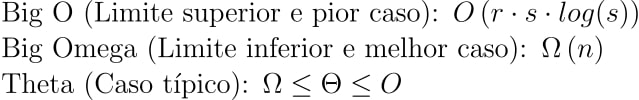
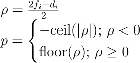
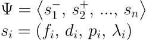
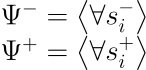
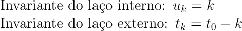
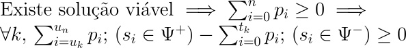
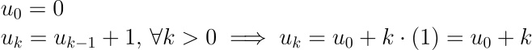
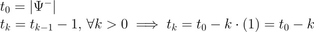

# Complexidade e corretude do algoritmo

## Complexidade do algoritmo

Este artigo apresenta uma análise detalhada do algoritmo de alocação fornecido em 'codigo\backend\planejador\src\algoritmo\greedy_algorithm.py', focando na determinação dos casos pior e melhor em termos de complexidade computacional. Utilizaremos a notação Big O, Big Omega e Theta para expressar as complexidades nos diferentes cenários.

### Pior Caso
O pior caso ocorre quando o algoritmo precisa executar todas as suas operações com a maior quantidade de dados possíveis. Isso acontece quando todos os setores são considerados, tanto para recebimento quanto para envio, e quando as condições para continuar as iterações nos laços são sempre verdadeiras até o limite.

### Características do Pior Caso:

Número elevado de setores: A complexidade aumenta com o número de setores.
Distribuição igual de setores receptores e emissores: Maximiza o número de iterações na alocação de recursos.

Neste cenário, o algoritmo tem a seguinte complexidade:

Complexidade de evaluate_scores: O(n)

Complexidade de filtragem: O(n) para receptor e emissor

Complexidade da ordenação: O(r.s.log(s)), onde r é o número de setores receptores e s é o número de setores emissores.

Portanto, a complexidade total no pior caso é dominada pela expressão O(r.s.log(s)).

### Melhor Caso
O melhor caso ocorre quando o algoritmo realiza o mínimo de operações possíveis. Isso é alcançado quando as condições iniciais permitem que o algoritmo encerre rapidamente, sem necessidade de percorrer todos os setores ou realizar a ordenação.

### Características do Melhor Caso:

Todos os setores com pontuação positiva: Isso evita a necessidade de alocações.
Soma das pontuações dos setores negativa: Isso retorna rapidamente um tipo de solução (inviável) rapidamente.
A complexidade neste cenário é principalmente devido à função evaluate_scores, sendo O(n).



## Corretude do algoritmo 

Para conferir se o algoritmo funciona da maneira desejada. Será necessário fazer uma análise da sua corretude.

Para facilitar o entendimento de cada passo, um pseudo-código abaixo explica como esse algoritmo deve funcionar. Lembrando que, para o entendimento mais aprofundado, será necessário verificar a doumentação no próprio código: 

```yaml
-- tipos de dados -- 
(c) Setor:
    attrs:
        id
        demands
        workers
        distances
        score*
        
(c) SolutionType:
    consts:
        DONE
        UNFEASIBLE
        SUBOPTIMAL
        
(c) Transaction:
    attrs:
        sender_sector
        receiver_sector
        amount

-- variáveis advindas dos dados do cliente --
sectors # lista de objetos da classe Sector 

-- funcionamento do algoritmo -- 

(f) check-scores # retorna uma constante SolutionType (típo da solução do problema proposto pelo cliente)
if not SUBOPTIMAL return ERROR and HALT # retorna erro e para o programa caso o algoritmo não consiga otimizar o problema
(f) sort & split # divide a lista sectors em sender_sectors e receiver_sectors, ou seja, setores com scores positivos e negativos respectivamente
while receiver_sectors not empty: # esse loop acontece enquanto todos os setores não tiverem scores não negativos, ou seja, enquanto ainda existem demandas não atendidas
    (f) get_first_sector # seleciona o primeiro elemento da lista receiver_sectors 
    (f) sort_sender_sectors # faz a ordenação dos setores da lista sender_sectors de forma crescente de acordo com o seu custo de deslocamento para o setor receptor 
    (f) fill_sector # utiliza os funcionários em excesso da lista ordenada sender_sectors até que o score do setor receptor seja nulo e cria um objeto Transaction (transação)
    (f) remove_first_sector # remove o setor receptor da lista, uma vez que o mesmo já atendeu as suas demandas
    (f) add_cost # adiciona o custo dessa transação para o custo total da solução
    (f) add_to_solution # adiciona a transação a lista de transações dessa solução
return solution and HALT # retorna a solução em forma de uma lista de objetos Transaction (transação) e o custo total
```

> OBSERVAÇÕES:
> - \* score ($p_i$): O score (escore) de um setor $i$ representa a quantidade de funcionários em excesso ou em falta nesse setor. Ele pode ser determinado pela fórmula matemática abaixo:



$$
\begin{array}{l}
f_i: \text{ Número de funcionários em $i$}\\
d_i: \text{ Número de demandas em $i$}
\end{array}
$$

Compreendendo a funcionalidade básica do algoritmo, será possível analisar a sua corretude por meio da lógica de corretude de algoritmos. Assim, cria-se a lista genérica de setores $\Psi$:



> OBSERVAÇÕES:
> - $s^+$ representa setores com scores positivos, enquanto $s^-$ representa setores negativos 
> - A lista de distâncias entre um setor $i$ para um setor $j$ é representado por $\lambda_i$

A primeira etapa do algoritmo é a separação dos setores entre aqueles com scores negativos e aqueles com scores positivos, descartando os setores com scores neutros:



Supomos, então, que existem $t_0$ elementos no vetor $\Psi^-$ e que $u_0$ representa um ponteiro no vetor $\Psi^+$ na primeira iteração de cada laço.

Assim, pode-se dizer que o algoritmo terá $t_0$ iterações.

### Regra do laço 

Para verificar a corretude do algoritmo para todos os laços, será necessário aplicar a regra do laço:



No laço interno:



A imagem acima prova que a saída do laço interno ocorre em todas as iterações para todos os problemas SUBOPTIMAL

> OBSERVAÇÕES:
> - $\sum_{i=u_k}^{u_n}p_i;\,\left(s_i \in \Psi^+\right)$ representa o número de funcionários que ainda estão disponíveis para a realocação na iteração $k$
> - $\sum_{i=0}^{t_k}p_i;\,\left(s_i \in \Psi^-\right)$  representa o número de demandas que ainda não foram atendidas na iteração $k$
> - $k$ não representa a k-ésima iteração no algoritmo como um todo, mas sim, em cada laço. Logo, $k$ em $u_k$ é diferente de $k$ em $t_k$

A invariante do laço interno é comprovada abaixo:

```python
            index: int = 0
            while receiver_sector.score < 0:
                # ...
                index += 1
```

A variável `index` representa o $u_k$. $u_0$ incia-se com o valor $0$ e o seu incremento unitário a cada iteração permite concluir que:



No laço externo, a invariante do laço externo é comprovada abaixo:

```python

while len(receiver_sectors) > 0:
    # ...
    receiver_sectors.remove(receiver_sector)
```

A expressão `len(receiver_sectors)` representa $t_k$, sendo $t_0$ o número de setores com score negativo no início do algoritmo. Esse número é decrementado uma unidade a cada iteração. Isso permite afirmar a conclusão abaixo:



