# Contexto e Modelagem do Problema de Alocação de Técnicos

## Descrição do Problema

O problema em questão está inserido no contexto de uma empresa de rede neutra, onde a operação é dividida em várias áreas, cada uma com um número predefinido de técnicos responsáveis por atender aos pontos de atendimento. Dentro dessas áreas, encontram-se distribuídos clientes que demandam serviços técnicos. No entanto, a alocação atual de técnicos é uma tarefa extremamente trabalhosa e repetitiva, uma vez que o cenário deve ser recalculado toda vez que houver alguma alteração de demanda e oferta de serviço.

## Descrição da solução

Para atingir esse objetivo, é crucial obter uma compreensão detalhada das operações da empresa. Inicialmente, as regiões de atuação são subdivididas em setores menores, facilitando o acompanhamento das demandas. Cada setor detém uma quantidade específica de técnicos disponíveis para a execução dos serviços. Além disso, destaca-se a possibilidade de realocar técnicos entre os setores, a fim de evitar a necessidade de novas contratações. Existe também a prática de ajustar o tamanho dos setores para atender às necessidades específicas de cada região. 

Neste estágio, A solução proposta simplifica a dinâmica ao considerar os setores como entidades fixas. Este enfoque inicial visa facilitar o desenvolvimento da solução.

O objetivo deste projeto é a criação um algoritmo de alto desempenho capaz de otimizar a distribuição de técnicos, por meio da configuração minimizada de deslocamentos entre os setores que acarretem em menores custos e que garantam o suprimento de todas as demandas de cada região. Isso resultará em uma gestão mais eficaz dos recursos disponíveis.

## Variáveis do Problema

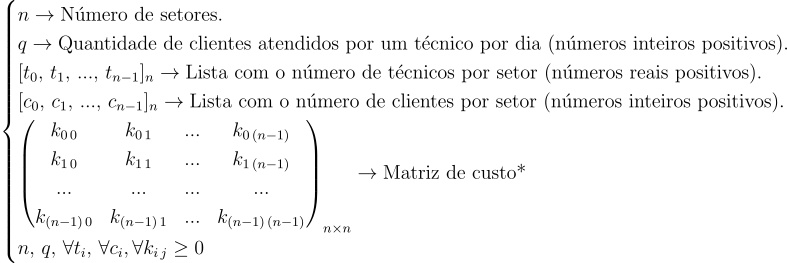

>  * O elemento $k_{i\,j}$ representa o custo de realocação do setor $i$ para o setor $j$.

## Variáveis de Decisão

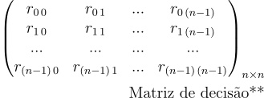

> ** O elemento $r_{i\,j}$ representa o número de técnicos que devem ser deslocados do setor $i$ para o setor $j$ para atender às restrições e à função objetivo.

## Função Objetivo

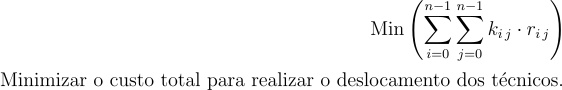

## Restrições

Para todo $i$ de 0 a $n$ (ou seja, para toda região), as seguintes condições devem ser satisfeitas:

## Gargalos do Problema

Em nosso algoritmo os gargalos podem ser percebidos ao analisar as restrições que guiam o nosso modelo. Quando nós observamos que as restrições estão sendo utilizadas no limite, ou seja, não há recursos disponíveis não utlizados.
É importante ressaltar gargalos não são necessariamente prejudiciais para o desempenho do modelo. Eles indiciam áreas em que todos os recursos disponíveis estão sendo usados ao máximo.

Dado um exemplo de 3 setores: 
* Setor 1: 5 técnicos para atenderem 10 demandas.
* Setor 2: 1 técnico para atenderem 6 demandas.
* Setor 3: 8 técnicos para atenderem 12 demandas.

Se assumirmos que cada técnico consiga atender no máximo 2 demandas por dia, nota-se que o técnico do setor 2 não consegue atender as 6 demandas previstas para o setor, além disso, também podemos ver que os 8 técnicos que estao no setor 3 conseguiriam atender 16 demandas, contudo só há 12 demandas. Por isso, poderíamos transferir 2 técnicos do setor 3 para o setor 2:

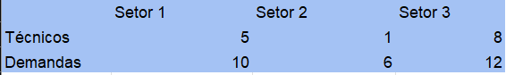

Após o algoritmo fazer essa transferência dos dois técnicos do setor 3 para o setor 1, podemos identificar apenas um gargalo no algoritmo, que seria o da restrição 1, que diz que a soma dos técnicos que entram com os técnicos que saem do setor (lado esquerdo da inequação) está igual ao número de demandas do setor (lado direito da inequação). Enquanto que nas restrições 2 e 3 não há gargalos pois estes valores estão com diferenças discrepantes entre a soma dos técnicos e o número de demandas.

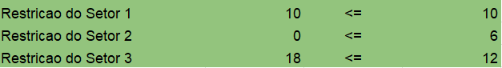

Tomando um outro exemplo, também de 3 setores:
* Setor 1: 5 técnicos para atenderem 10 demandas.
* Setor 2: 4 técnicos para atenderem 6 demandas.
* Setor 3: 5 técnicos para atenderem 12 demandas.

Para que cada técnico consiga atender 2 demandas e não haja demandas sobrando em nenhum setor, teremos que transferir um técnico do setor 2 para o setor 3.

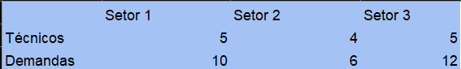

Depois da transfêrencia do técnico do setor 2 para o setor 3, podemos observar que os 3 setores estão em gargalo. Ou seja, em cada um dos 3 setores a soma dos técnicos que entram com os técnicos que saem é igual a demanda daquele setor.

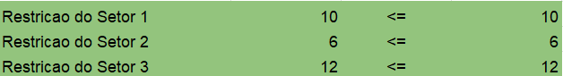

## Análise considerando diferentes cenários de demanda e custos de transporte.

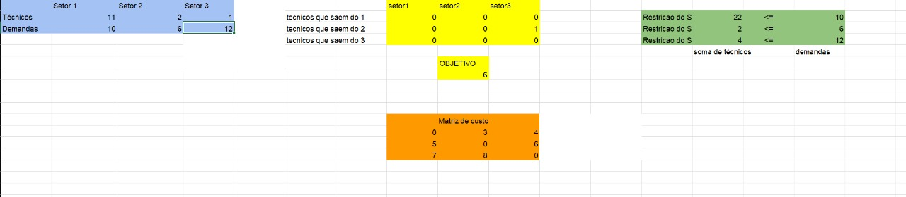

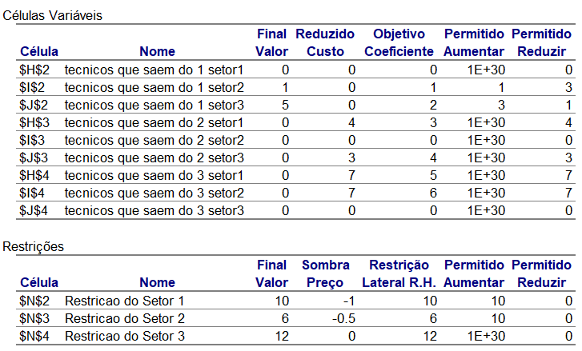

No primeiro cenário, observamos uma concentração significativa de técnicos no setor 1, onde a proporção de técnicos é muito maior do que o necessário para atender à demanda. Por outro lado, nos setores 2 e 3, temos uma quantidade limitada de técnicos em relação a uma alta demanda. Temos uma restrição que diz que mesmo após os devidos deslocamentos, deve ser positivo : 

$t_i + \sum_{j=0}^{n-1} r_{ji} - \sum_{j=0}^{n-1} r_{ij} \geq 0$

Como resultado, nosso modelo de alocação efetivamente distribuiu os técnicos do setor 1 para os respectivos setores com carência, otimizando a distribuição e, ao mesmo tempo, cumprindo a restrição, é importante destacar que, se o custo de deslocamento dos técnicos do setor 1 para o setor 2 estiver dentro do intervalo de -2 a 2, e o custo de deslocamento do setor 1 para o setor 3 estiver entre 1 e 5, isso não afetará a quantidade de técnicos realocados, que, no caso, é de 6.

Sobre o volume de ordens de serviço no setor, podemos chegar à seguinte conclusão para o setor 3: $2 \geq \frac{x}{1+5+0} $ , e para o setor 2: $2     \geq \frac{x}{2+1+0}$ . A partir dessa equação, podemos deduzir que o número de serviços no setor 3 deve satisfazer a condição $x ≤ 12$ e para o setor 2: $x ≤ 6$. Com essa informação, podemos tomar decisões sobre a eficiência da quantidade de técnicos nesses setores.

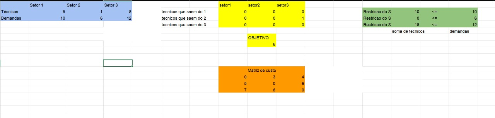

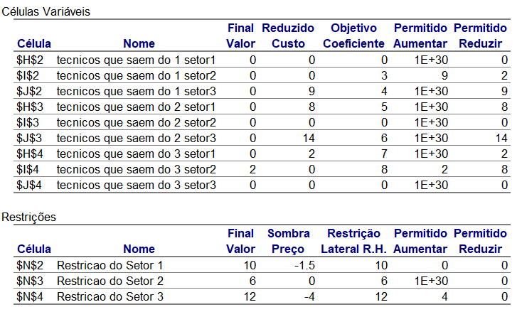

No segundo cenário, mais uma vez, notamos uma concentração de técnicos em uma área específica. No entanto, quando avaliamos a variação nos custos de deslocamento dos técnicos, uma perspectiva diferente surge. A partir da análise do Relatório de Sensibilidade, podemos inferir que, se o custo de deslocamento do setor 3 para o setor 2 estiver dentro do intervalo de 0 a 10, isso não terá impacto na quantidade de técnicos a serem realocados, que, no caso, seria de 2 técnicos.

O volume de ordens de serviço no setor nos leva a concluir que para o setor 2: $2 \geq \frac{x}{2+3+0}$. A partir dessa equação, podemos deduzir que o número de serviços no setor 2 deve satisfazer a condição $x ≤ 6$. Com essa informação, podemos tomar decisões sobre a eficiência da quantidade de técnicos nesse setor.

## Análise do Relatório de Sensibilidade em um aumento de 10%

**Tabela de Sensibilidade Normal**

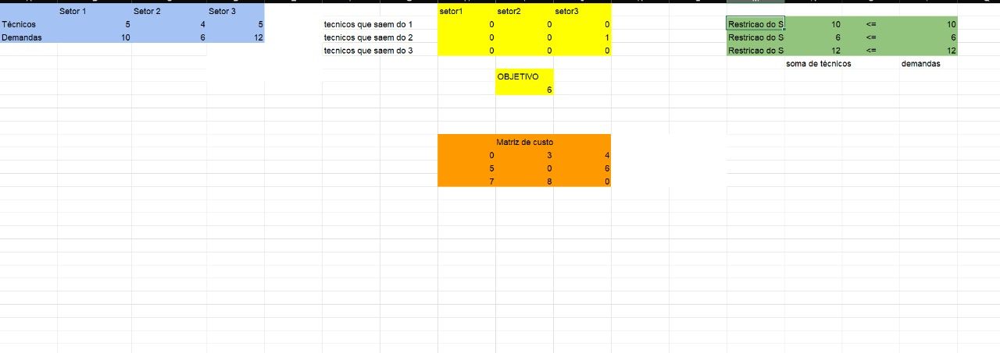

 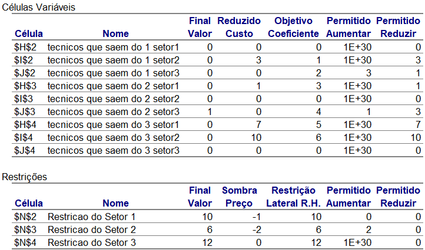

1. Um aumento de 10% no custo de deslocamento, por exemplo, dos técnicos que saem do 2 e vão para o setor 3, conforme indicado na coluna "Objetivo Coeficiente", não terá impacto no valor final. Isso se deve às informações cruciais fornecidas na coluna "Permitido Aumentar". Por exemplo, se aumentarmos as demandas em 10%, o custo passará de $4$ para $4.4$, enquanto o valor permitido para aumento é de $4 + 1$. Concluímos que a solução não é modificada! No entanto, é importante observar que há um impacto na nossa função objetivo de minimização, onde o valor é aumentado.

**Tabela de Sensibilidade 10%** 

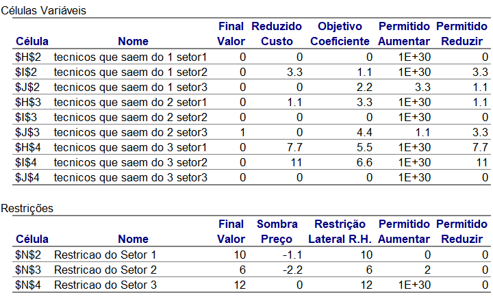

2. É importante notar que, caso o custo de deslocamento seja aumentado em 30%, o valor permitido para aumento seria ultrapassado. Portanto, aumentando a função objetivo implicará na modificação da solução.

**Tabela de Sensibilidade 30%**

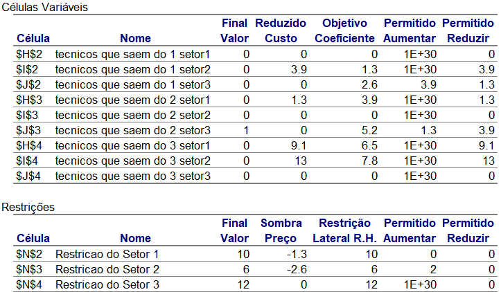
