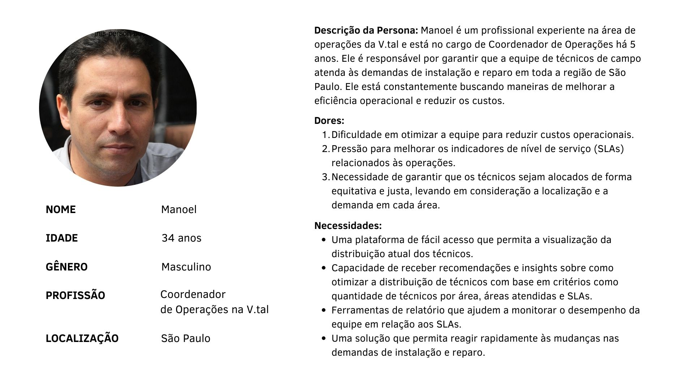
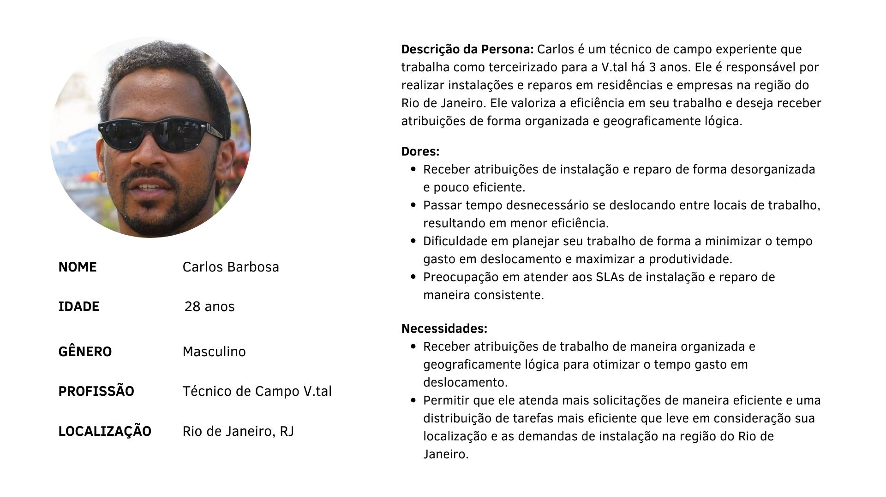
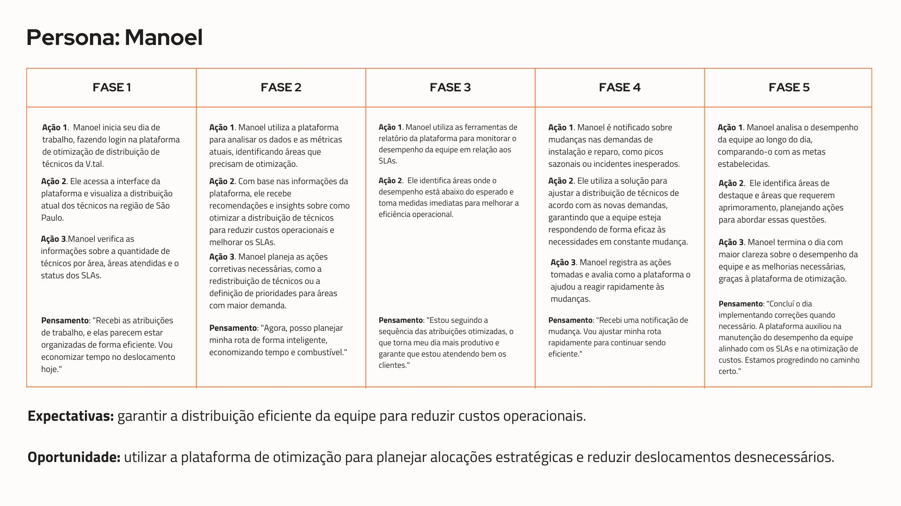

# Entendimento da experiência do usuário

## Personas

Personas são representações fictícias de segmentos de clientes com características, necessidades e comportamentos semelhantes. As personas são uma ferramenta valiosa para a tomada de decisões baseadas no cliente, permitindo uma personalização nas abordagens que atendam às demandas de públicos-alvo distintos.

Persona 1: Manoel, Coordernador de Operações na V.Tal.

Persona 2: Carlos Barbosa, Técnico de Campo na V.Tal.

## User Stories

As User Stories (Histórias de Usuário) são uma abordagem ágil para descrever requisitos de software de maneira simples e centrada no usuário. Elas fornecem uma maneira concisa e direta de expressar funcionalidades ou necessidades do usuário. Cada história de usuário captura uma única funcionalidade, seguindo uma estrutura básica que enfatiza quem é o usuário, o que ele deseja fazer e por quê.

Foram desenvolvidas algumas User Stories focadas no problema e nas necessidades das personas do projeto:

1. Como um coordenador de operações da V.tal, eu quero uma funcionalidade que automatize a definição da quantidade de técnicos necessários por setor, otimizando a distribuição de pessoas de acordo com as necessidades específicas de cada região, a fim de reduzir os custos operacionais.
2. Como um coordenador de operações da V.tal, eu quero ter a capacidade de visualizar as áreas atendidas por nossos técnicos, com destaque para aquelas com maior demanda de ordens de instalação e reparos, para tomar decisões informadas sobre alocação de técnicos.
3. Como um técnico de campo da V.tal, eu quero reduzir o tempo de deslocamento entre as instalações e reparos, para maximizar minha produtividade e aumentar os indicadores de nível de serviço (SLA'S). 
4. Como um analista de operações da V.tal, eu quero poder visualizar dados que mostrem a evolução do número de técnicos necessários para atender todas as solicitações e os indicadores de nível de serviço (SLA's), permitindo-nos avaliar a eficácia do algoritmo de otimização ao longo do tempo.
5. Como um diretor de operações da V.tal, eu quero garantir que os dados sensíveis e informações críticas relacionadas à distribuição de técnicos sejam protegidos de acordo com as normas de segurança de dados, para evitar violações de privacidade e garantir a integridade das informações.
6. Como um gerente de operações da V.tal, eu quero a capacidade de personalizar restrições específicas, como limites de deslocamento entre cidades e regulamentações de tempo de trabalho, para garantir a eficiência na distribuição de técnicos.
7. Como um coordenador de operações da V.tal, eu quero ter autonomia para tomada de decisões baseada em dados ao planejar a força tarefa, para que eu possa distinguir situações como contratar mais funcionários ou não para atender a demanda em certo período.

## Jornada do Usuário

A Jornada do Usuário é uma ferramenta essencial para entender as interações do usuário e como é possível melhorá-las. Toda interação pode ser traduzida em uma história sobre a relação do usuário com seu produto ou serviço. O usuário passa por uma jornada, um caminho, desde a pesquisa sobre o produto até sua compra, uso e interação. Essa Jornada do Usuário é a ferramenta que faz o mapeamento de todo esse processo de interação do consumidor. Por meio dela, podemos encontrar todos os pontos de contato que o usuário possui com o produto e montar uma história na qual ele é o protagonista. 

Em nosso contexto, elaboramos a Jornada do Usuário do Manoel, o Coordenador de Operações da V.Tal, nossa persona. Quanto à persona do técnico, decidimos não realizar a análise da Jornada do Usuário pois o técnico terá um impacto de forma indireta da nossa solução, não havendo necessidade dessa abordagem. 

Fonte: elaboração dos autores.
