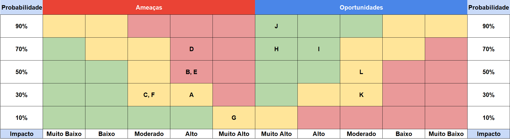

# Entendimento de negócio

## Matriz de Risco

Uma matriz de riscos é uma ferramenta utilizada na gestão de projetos e planejamento estratégico para ajudar organizações a entrenderem e gerenciarem riscos e oportunidades relacionadas a um projeto. Na matriz podemos extrair um meio de identificar e avaliar as incertezas que podem impactar nos objetivos do projeto, seja de maneira negativa, que seriam os riscos, seja de maneira positiva, que seriam as oportunidades.

No atual projeto foram identificados no total 7 riscos e 5 oportunidades, que foram classificadas em 10, 30, 50, 70 e 90% de probabilidade de acontecimento, enquanto que o impacto do acontecimento foi classificado em muito baixo, baixo, moderado, alto e muito alto.

### Legenda:

* **A:** Ineficiência do algoritmo de otimização.
* **B:** Falha na integração com os sistemas existentes.
* **C:** Resistência a mudança por parte dos colaboradores da V.tal.
* **D:** Falta de treinamento suficiente para usar a nova plataforma. 
* **E:** Deslocamento ineficiente dos técnicos.
* **F:** Indisponibilidade da plataforma. 
* **G:** Vazamento de dados financeiros e dos funcionários da V.tal.
* **H:** Redução dos custos associados a alocação de técnicos entre setores.
* **I:** Melhoria nos SLAs.
* **J:** Melhoria na satisfação do cliente.
* **K:** Otimização do tempo de Instalação. 
* **L:** Expansão do algoritmo de otimização para outras áreas da empresa.

## Value proposition canvas 

O Canvas de proposta de valor é uma ferramenta estratégica muito utilizada por empreendedores para representar o seu negócio de forma mais clara. Ele descreve o que é o produto o serviço oferecido e o que esse bem oferece para o cliente interessado em adquirí-lo.

## Análise financeira do projeto

Acreditamos firmemente que o projeto terá um impacto significativo na economia de tempo para a V.tal. Para ilustrar, se um funcionário responsável por múltiplas regiões, onde os técnicos podem ser realocados, atualmente gasta uma hora por dia tentando encontrar uma configuração otimizada, nosso algoritmo pode realizar essa tarefa em um tempo médio de apenas 3 minutos. Isso representa uma redução de 95% no tempo despendido. Além disso, o algoritmo garante a obtenção da melhor configuração possível, algo que se torna humanamente inviável em problemas de grande escala.

Ao levarmos em conta que um grupo composto por seis estudantes universitários do segundo ano está recebendo individualmente o salário correspondente a um programador júnior (R$2.751,00), e que o projeto demandaria dois meses para sua conclusão, o custo total do projeto é estimado em R$33.012,00.

## Matriz de Avaliação de Valor Oceano Azul

A análise de negócio realizada a seguir se encontra no livro ”A Estratégia do Oceano Azul” – Como criar novos mercados e tornar a concorrência irrelevante 
(Blue Ocean Strategy: How to Create Uncontested Market Space and Make Competition Irrelevant) de Renée Mauborgne e W. Chan Kim. Essa estratégia serve para desenhar modelos de mercados “inexistentes” que, quando encontrados e explorados, são potenciais geradores de vantagens competitivas sustentáveis. O conceito de Oceano Azul é definido justamente como o novo mercado, criado (inventado) por uma organização, no qual a estratégia não é enfrentar a concorrência, mas gerar um ambiente não concorrencial, cujos concorrentes sofrem dificuldades para replicar, ou imitar, o modelo de negócio proposto pelo inovador de valor, levando a concorrência a ter dificuldade em seguir os passos deste inovador, que entrega ao seu cliente, um valor superior.

Em nosso contexto, tendo a V.Tal como parceira, estamos levando em consideração o seu problema de otimização de rotas. Nesta análise, utilizaremos o framework de 4 ações do Oceano Azul: Reduzir, Eliminar, Aumentar e Criar. O intuito neste caso é encontrar atributos que são importantes para os clientes da V.Tal e diferenciá-los da concorrência. No geral, foram escolhidos 9 atributos.

### Reduzir
Aqui, respondendo perguntas como "Quais atributos podem ser reduzidos com relação a competição?", devemos retomar o problema. A V.Tal, devido sua grande operação e força de campo em realizar reparos e instalações, realiza grande esforços ao alocar seus técnicos para fazer esses reparos e instalações. Logo, tendo uma solução para otimizar esse processo, resulta na redução dos seguintes fatores: 
* *Custos* - uma vez que o planejador revela com precisão a quantidade de técnicos necessários para uma operação naquele dia, a redução macro disso tudo são os custos. Pois através dele, menos funcionários são necessários para coordenar e, consequentemente, menos deslocações desnecessárias pela cidade também, economizando em infraestrutura como combustível e depreciação do automóvel utilizado pelo técnico.
* *Tempo de planejamento* - os coordenadores, com o auxílio da ferramenta, terão mais autonomia ao realizar o planejamento, reduzindo eventuais dúvidas, erros e, principalmente, o tempo planejando essa operação. 
* *Tempo de atendimento* - uma vez que o planejamento é feito de forma eficaz e os técnicos são alocados de uma forma melhor, eles se deslocarão menos e, com isso, resultará em um tempo de atendimento menor. 
* *Erros* - decisões como "É melhor mudar o técnico de setor ou dividir o setor?" ficam a cargo de uma pessoa, sendo suscetível a erros. O algoritmo, diferente da capacidade humana, será suscetível a poucos erros. Logo, reduzirá a taxa de técnicos que foram alocados de forma incorreta ao fornecer os dados corretos. 
  
### Eliminar 
Neste tópico, o mais importante é o valor que a V.Tal agrega ao cliente. Ao responder a pergunta "Os atributos existentes em função de competição, podem ser eliminados, sem afetar o valor que o cliente percebe?", nós entendemos que a real mudança e oferta de valor se encontra aqui, pois desencadeia todo um processo posteriormente.

* *Dependência humana* - como citado anteriormente, ao planejar uma operação no dia dia, os coordenadores estão suscetíveis a erros e dúvidas. Com o auxílio do algoritmo, a dependência humana será o principal fator que será eliminado. 

Gostaríamos de destacar que, ao eliminar a dependência humana, não estaremos eliminando a supervisão humana completamente. A ferramente servirá a todo momento como um auxílio a mais nas decisões. Logo, o que realmente importa, não é o fato de eliminar a dependência humana em si, mas a consequência dessa deleção. 

Os efeitos disso refletem numa maior precisão, produtividade, agilidade e reduzem os custos, tempo de planejamento, tempo de atendimento e erros. O valor que a V.Tal irá agregar a partir dessa escolha será muito maior ao seu cliente. 
### Aumentar 
Essa questão faz, novamente, reavaliar as forças competitivas da V.Tal em relação ao mercado. Perguntas como "Quais atributos o segmento de negócio oferece, discretamente e que podem ser elevados?" se encaixam totalmente nesse cenário. 

A V.Tal é a maior e melhor rede neutra de fibra ótica do Brasil, com uma cobertura e força de campo expressiva. Ela possui uma infraestrutura digital de fibra óptica, 21 milhões de casas passadas com FTTH (serviço de fibra óptica para residências), 26 mil quilômetros de cabos submarinos e com edge data centers espalhados no Brasil e Colômbia. Esses dados demonstram seus pontos fortes e a importância que dados para tomada de decisões, assim como produtividade têm no seu dia a dia. Com isso, o que podemos aumentar com a solução é:

* *Autonomia para tomada de decisões* - aqui pode levar em consideração tanto a autonomia para tomada de decisões diárias ao planejar a força tarefa, visto que o coordenador as fará de forma mais assertiva, como também tomada de decisões mais estratégicas - ao determinar se irá contratar mais funcionários ou não para atender a demanda em certo período. 
* *Agilidade/produtividade do técnico* - é nítido que ao otimizar todo processo, estaremos valorizando a rota do técnico. E ao valorizar sua rota, podemos fazer com que seu dia seja mais produtivo. 
* *Melhoria nos indicadores de nível de serviço* - os indicadores de SLAs (Service Level Agreement) receberão uma potencial melhora caso os serviços sejam mais rápidos e mantenham a qualidade.
### Criar

Por último e levantando a questão "Quais atributos o segmento de negócio não oferece e que podemos criar para gerar valor?", diferente de apenas dizer que a solução "criará uma nova oportunidade", decidimos ir além nessa análise e citar algo observado durante o Workshop com o parceiro. Uma vez que temos todos os dados comentados na análise acima, fica muito mais assertivo traçar um S&OP (Sales & Operations Planning) da alocação de técnicos. Com isso, surgem novas ideias e campanhas que os coordenadores da V.Tal podem criar: 
* *Novas/diferentes campanhas de produtividade* - o algoritmo pode ajudar a estimular novas campanhas para funcionários produzirem mais - eles vão faturar e produzir mais. Campanhas como "se o técnico realizar x reparos durante a sequência de y dias receberá z reais" estimulam a produtividade e, com o auxílio da inteligência criada, poderá determinar quais são os melhores períodos para realizar tal, uma vez que os coordenadores da V.Tal terão esses dados em mãos. 

### Conclusão

Para concluir a análise de valor Oceano Azul, gostaríamos de centralizar a ideia de que ao otimizar o processo com uma inteligência matemática e computacional isso terá um efeito geral na alocação de técnicos da V.Tal, tendo um impacto principal no tempo de atendimento e redução de custos. Essa é uma análise importante de se ter pois uma vez identificado que esses efeitos realmente acontecem, o que a V.Tal pode fazer com isso? No caso de tempo de atendimento, melhorias nas métricas acontecerão e valorização da rota do técnico, já a redução do custo pode ser utilizada para a V.Tal obter um maior lucro em seus serviços e investir em novos projetos, ou, caso desejarem, também reutilizar essa redução de custo e reduzir o preço de seus serviços, diferenciando-se da concorrência, tema central da estratégia Oceano Azul. 
