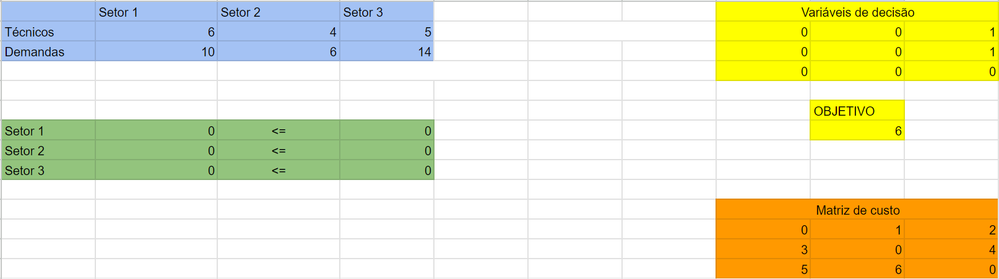
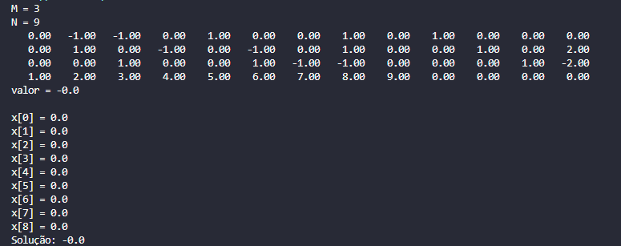

# Versão simplificada da solução

## Documentação de testes 

O seguinte arquivo se refere à documentação de testes realizada na Sprint 2 para a versão inicial e simplificada da solução 

O nosso grupo abordou a solução de 3 maneiras: Solver, utilizando o Simplex do Google Sheets; Python, uma solução com testes; Java, uma solução inicial não finalizada. Além disso, devido a nossa modelagem matemática, também criamos uma matriz para os custos de deslocamento que posteriormente será integrada ao nosso algoritmo final. 

## Solver (Google Sheets)
Com o objetivo de validar nossa solução, criamos um arquivo do Google Sheets e mapeamos um cenário simplificado do problema. O arquivo pode ser encontrado aqui: https://docs.google.com/spreadsheets/d/1a-ymzGZK7AUiDN7Xn2qvUsEXvKodiTbDG4GSJndHsiI/edit#gid=0. 

Nele, definimos uma quantidade de técnicos e demanda para cada setor. O resultado final, observado na variável de decisão, revela o valor correto da solução - que foi verificado por nós através de cálculos matemáticos. Foi aplicado o Simplex nele.

## Java

Como nossa modelagem matemática se encaixa no Simplex, desenvolvemos um algoritmo Simplex inicial para resolver o problema simplificado. No entanto, após testes e depuração, o código está retornando valores errôneos para a solução, como os a seguir: 

Logo, futuras estratégias serão aplicadas para a resolução do problema através da linguagem Java.

## Python

Como neste caso não conseguimos testar nossa solução com Java, decidimos abordar, por enquanto e somente neste momento, em Python. No total, realizamos 5 testes que pode ser acompanhado no arquivo testes_simplex.py em codigo > versao_simplificada.