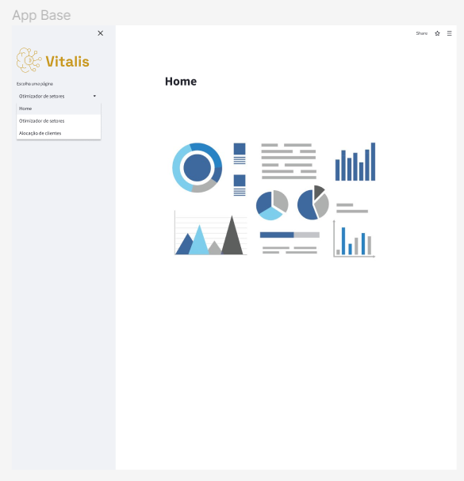

# Documentação - Frontend 
O presente documento visa documentar o processo de criação do Frontend, desde as ideias e esqueleto inicial, passando pelo mockup e depois seu desenvolvimento. 

## Problemática e requisitos
Retomando o objetivo da nossa solução: otimizar a alocação de técnicos da parceira V.Tal, por meio da configuração minimizada de deslocamentos entre os setores que acarretem em menores custos e que garantam o suprimento de todas as demandas de cada região.

Inicialmente, as regiões de atuação são subdivididas em setores menores, facilitando o acompanhamento das demandas. Cada setor detém uma quantidade específica de técnicos disponíveis para a execução dos serviços. Além disso, destaca-se a possibilidade de realocar técnicos entre os setores, a fim de evitar a necessidade de novas contratações. Existe também a prática de ajustar o tamanho dos setores para atender às necessidades específicas de cada região. 

Com essa problemática inicial e retomando as user stories analisadas, temos os seguintes requisitos para nosso frontend: 

* Funcionalidade que automatize a definição da quantidade de técnicos necessários por setor, otimizando a distribuição de pessoas de acordo com as necessidades específicas de cada região. 
* Visualização das áreas atendidas por nossos técnicos, com destaque para aquelas com maior demanda de ordens de instalação e reparos. 
* Visualização do resultado final do algoritmo, mostrando a configuração de técnicos de cada setor. Por ex: "Setor x1 recebe y técnicos" e "Setor x2  transfere z técnicos". 

## Esboço inicial
Nosso esboço inicial levou em consideração os requisitos levantados acima, colocando uma sidebar para inputar os dados que serão processados pelo algoritmo e ao lado esquerdo a visualização dos setores de forma geográfica através de um mapa. Outras funcionalidades serão exploradas no wireframe. 

## Mockup
Um Mockup é uma representação visual da estrutura e funcionalidade de uma página web, com o intuito de ser simples, para localizar os elementos necessários e sua disposição no desenvolvimento. 

Nosso mockup foi desenvolvido em nosso repositório do Figma, plataforma para edição e criação gráfica. O link se encontra em: https://www.figma.com/file/7tdKY9wMMxAuJNIIIDbwyb/Projeto?type=design&node-id=2%3A2&mode=design&t=KQJN8AdAGqbLdzxE-1.

### Versão 1.0.

O primeiro resultado do nosso Mockup visa cumprir as metas da nossa solução, de ser uma aplicação simples e eficiente. Os componentes são de acordo com o Streamlit, biblioteca de Python para desenvolvimento web que estamos utilizando. 

No geral, a primeira versão do nosso Mockup aborda a ideia das seguintes páginas: 
* Home - um local para analisar dados sobre as otimizações, com números e gráficos;
* Otimizador de setores - para retornar a distribuição de técnicos entre os setores;
* Alocação de clientes - quais clientes devem ser atendidos por quais técnicos;
* Roteiro de técnicos - a rota que o técnico deve percorrer para minimizar custos.

Os últimos dois tópicos ainda estão em observação e serão adicionados posteriormente neste documento mais informações sobre. 

No que tange o restante da aplicação, a ideia é ter uma sidebar no canto esquerdo e o conteúdo no restante da página. Nessa sidebar é possível alternar entre as páginas, observando diferentes conteúdos ao trocar pelo menu e também é possível adicionar os dataframes respectivos para a modelagem do problema e retornar a solução. 

### Versão 1.1.

Nossa home é a primeira impressão que os visitantes têm da nossa plataforma, e por isso atualizamos alguns detalhes para torná-la mais minimalista e objetiva e informativa. 

Agora, os usuários encontrarão facilmente as informações mais relevantes, proporcionando uma experiência de navegação mais agradável desde o primeiro contato.